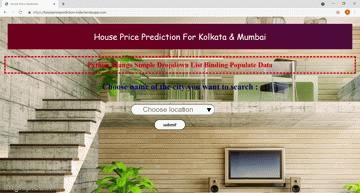

# House_Price_Prediction_Using_Django_Heroku For Kolkata & Mumbai

 

## Project Objectives :
The objective of the project is to create a machine learning model. We are doing a supervised learning and our aim is to do predictive analysis to predict housing price.

## Data Collection :
The dataset is obtained from Kaggle. 

Link: https://www.kaggle.com/ruchi798/housing-prices-in-metropolitan-areas-of-india

## Modelling :
The analysis and model creation can be found in the .ipynb file. 

The main packages used are numpy, pandas, matplotlib, seaborn and sklearn joblib .  

## Deployment :
The web app has been build using basic HTML, CSS, Javascript, Django and Herkou.

Link: https://housepriceprediction-india.herokuapp.com/

## Future Scope :
* Use multiple Algorithms
* Update the Front-End 
